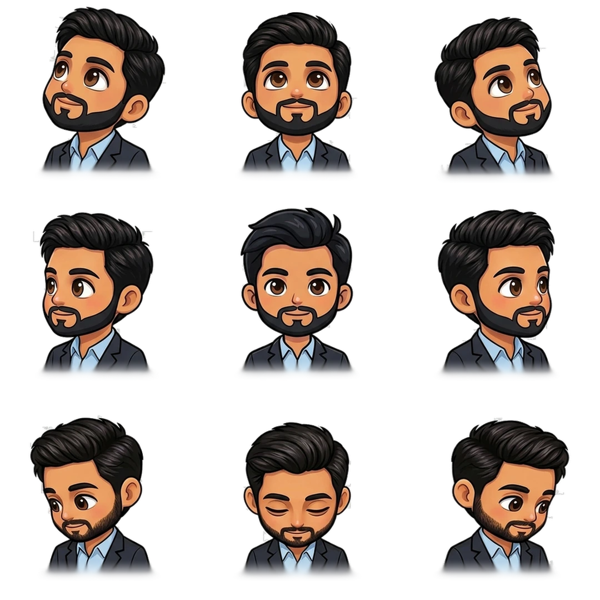
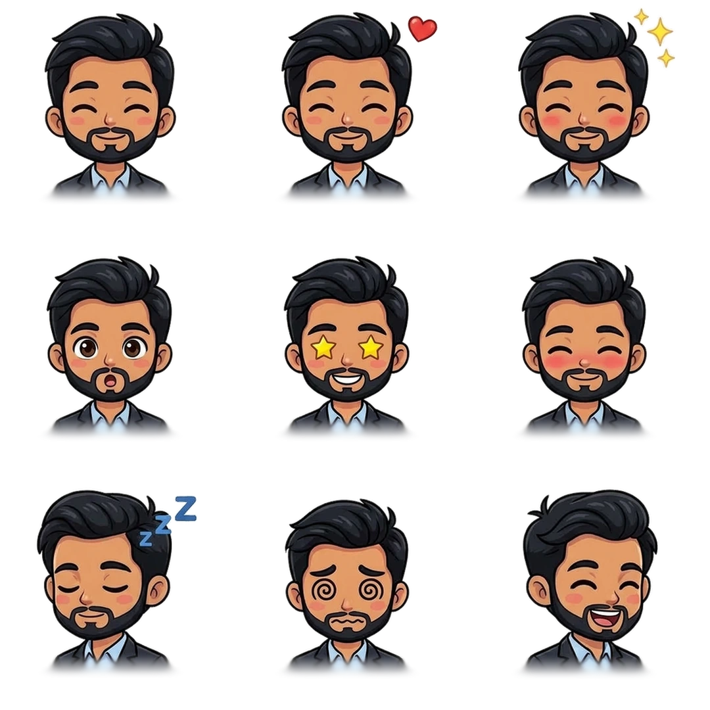
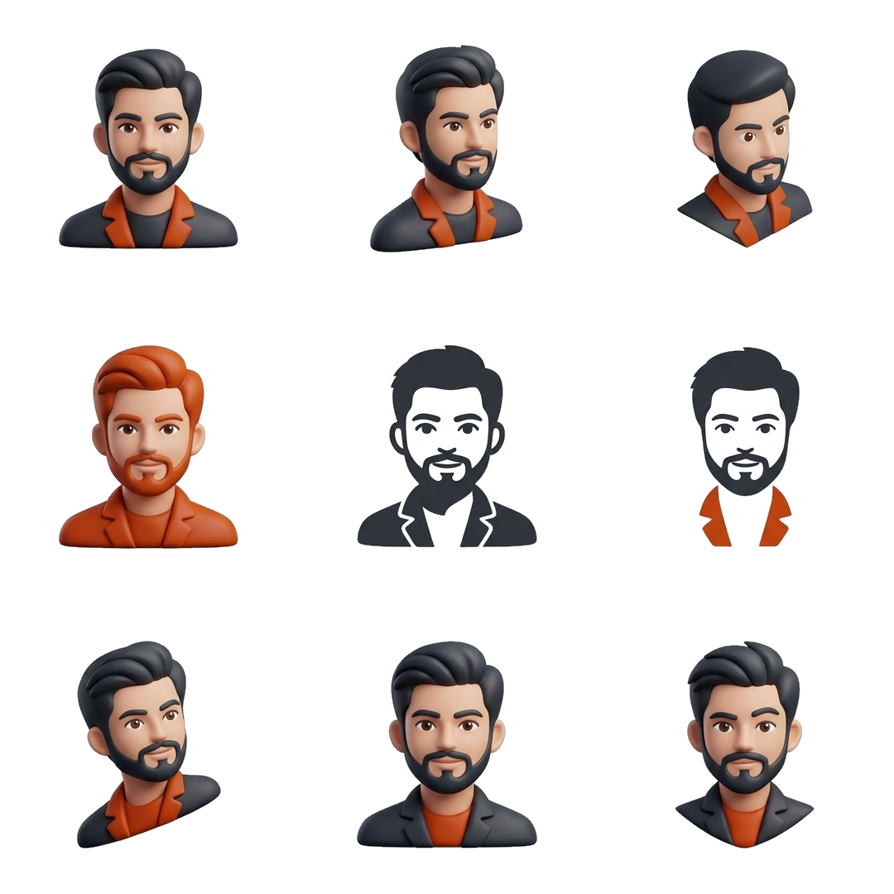

<div align="center">


# Mascen

**The Open-Source Interactive AI Mascot Engine & Studio**

An interactive, cursor-aware desktop and web mascot companion that breathes life into digital applications — backed by dual 3×3 sprite atlases, real-time physics, drop-in CLI components, and zero-clutter 3×3 logo generation.

[](https://opensource.org/licenses/MIT)
[](https://nextjs.org/)
[](https://react.dev/)
[](https://tailwindcss.com/)
[](https://sdk.vercel.ai/)
[](https://www.typescriptlang.org/)

</div>

---

## 🌟 What is Mascen?

Most web apps and developer tools are static, impersonal, and quiet. **Mascen** brings personality, delight, and character to modern web experiences through **Taqui**, an interactive cursor-aware mascot that lives in your interface.

Unlike bulky 3D canvases or resource-heavy video loops, Mascen operates on an ultra-lightweight **vanilla runtime** powered by **dual 3×3 sprite atlases**. It tracks the user's cursor across 9 directional angles, reacts to interactions with dynamic emotions, sleeps when idle, and can be dropped into **any project in 10 seconds**.

<div align="center" style="margin: 28px 0;">
  <p><b>Synchronized Dual 3×3 Sprite Atlases</b></p>
  <div style="display: flex; gap: 20px; justify-content: center; flex-wrap: wrap;">
    <div>
      
      <p><small><b>Sheet 1: 9 Head Directions</b> (Cursor Tracking)</small></p>
    </div>
    <div>
      
      <p><small><b>Sheet 2: 9 Emotional Reactions</b> (Interactions)</small></p>
    </div>
  </div>
</div>

---

## ⚡ Core Feature 1: The Interactive Mascot Engine

The interactive mascot is the heartbeat of Mascen. Built on a zero-dependency runtime, it transforms two 3×3 image matrices into an intelligent, animated character.

### 1. Dual-Atlas Architecture (The Atlas Contract)

The runtime positions a single element with `background-size: 300% 300%` and switches coordinate offsets (`0% / 50% / 100%`) without runtime layout recalculation or frame drops:

- **Look Sheet (`directions.webp`)**: Maps pointer coordinates to a local 3×3 directional pad:
  | | Left | Center | Right |
  | :--- | :--- | :--- | :--- |
  | **Up** | `up-left` | `up` | `up-right` |
  | **Mid** | `left` | `center` (dead zone) | `right` |
  | **Down** | `down-left` | `down` | `down-right` |

  *Hysteresis Filtering*: The center dead-zone dynamically scales with mascot size, applying edge dampening so the character never chatters or flickers when the cursor rests near cell boundaries.

- **Expression Sheet (`reactions.webp`)**: Triggers reactive emotional states:
  | | Column 0 | Column 1 | Column 2 |
  | :--- | :--- | :--- | :--- |
  | **Row 0** | `blink` | `heart` (love) | `sparkle` (celebrate) |
  | **Row 1** | `surprised` | `wink` | `bashful` |
  | **Row 2** | `sleepy` (curled nap) | `dizzy` (rapid click) | `delighted` (boop) |

### 2. Real-Time Interaction & Physics
- **Cursor Tracking**: Smooth head turns follow pointer movement anywhere on the screen.
- **Physical Boop**: Clicking the mascot triggers a spring squash-and-stretch with playful sound/particle callbacks and emotional rewards (`delighted`, `sparkle`, `heart`).
- **Dizzy State**: Rapidly clicking 4 times causes the character to spin its eyes in a comedic dizzy state.
- **Sleep Mode (`goToSleep`)**: Put the mascot to sleep when users are idle or when focus shifts; the character curls down and pauses tracking.
- **Reduced Motion Respect**: Automatically detects `prefers-reduced-motion: reduce` to skip squash physics and abrupt shifts while preserving gentle glances.

### 3. One-Command CLI Drop-in (`mascot-taqui`)
Drop any interactive mascot into your frontend repository with a single command:

```bash
# Add default mascot (Taqui)
npx mascot-taqui add --nextjs

# Add a built-in preset mascot (Fox, Pixel Fox, Ink, Riso, Sketch, etc.)
npx mascot-taqui add fox --nextjs
npx mascot-taqui add fox-pixel --react

# Add any custom mascot created in Mascen Studio by ID / code
npx mascot-taqui add <mascot-id> --nextjs
```

What `mascot-taqui add [code]` does automatically:
1. **Resolves Character Metadata**: Pulls built-in offline presets or retrieves custom character sprite sheets directly from Mascen Studio.
2. **Copies Assets**: Places `<slug>-directions.webp` and `<slug>-reactions.webp` directly into your framework's public asset directory (`public/mascots/`, `src/assets/`, or `static/`).
3. **Detects Framework**: Automatically targets **Next.js**, **React**, **Vue**, **Svelte**, **Angular**, **Astro**, or **HTML**.
4. **Generates Pre-bound Wrapper**: Writes a typed, zero-overhead `<Mascot />` wrapper with `label`, `directions`, and `reactions` pre-wired:

```tsx
import { Mascot } from '@/components/mascot'

export function Hero() {
  return (
    <Mascot
      className="bg-amber-400"
      size={140}
      label="Fox"
      idleBlink={true}
      followPointer={true}
    />
  )
}
```

### 4. Automated Character Generation Pipeline
Mascen includes an end-to-end Computer Vision and AI generation pipeline that creates brand-new interactive mascots from scratch:
- **Dual Synthesis**: Synthesizes Sheet 1 (9 head orientations), then synthesizes Sheet 2 (9 emotional reactions) using Sheet 1 as a visual reference to preserve exact character proportions, lighting, and palette.
- **Morphological Alpha Extraction** (`lib/pipeline/build.py`): Strips backgrounds using distance-transform edge feathering to output pristine transparent alpha.
- **Physics & Metric Screening** (`lib/pipeline/verify.py`): Checks boop shifts, palette agreement, and shoulder stability across both sheets before publishing.

---

## 🎨 Core Feature 2: 3×3 Mascot Logo Studio

As a complementary studio tool, Mascen includes a dedicated **3×3 Mascot Logo Sheet Generator** designed for founders and creators who need clean brand marks without messy text captions.

<div align="center" style="margin: 20px 0;">
  
  <p><small><b>9-Variant Mascot Logo Matrix</b>: Pure transparent alpha channel, zero typography clutter</small></p>
</div>

<div align="center" style="display: flex; gap: 16px; justify-content: center; margin-bottom: 24px;">
  
  
  
  
</div>

- **9 Cohesive Variations Per Sheet**:
  - **Row 1 (Framing & Silhouettes)**: Circular emblem badge, squircle app icon, standalone die-cut sticker contour.
  - **Row 2 (Palette & Emphasis)**: Signature brand palette, high-contrast dark silhouette, minimalist negative space.
  - **Row 3 (Angles & Energy)**: Expressive playful wink, front-facing primary mark, dynamic isometric character tilt.
- **Interactive Workbench**: Canvas stage with real-time backdrop switcher, badge framing, rotation, and 1-click lossless PNG/WebP exports.
- **Auto-Published Community Feed**: Newly generated marks automatically stream into the community showcase with instant upvoting.

---

## 🔑 Bring Your Own Key (BYOK) Model

Mascen is built with an **open, no-auth, user-owned architecture**:

- **No Mandatory Accounts**: Jump straight into the mascot engine or logo studio without login walls or registration friction.
- **Client-Side Key Security**: Add your API key in studio settings. Keys are stored solely in your browser's `localStorage` and passed through transient request headers.
- **Zero Token Markup**: You burn your own API tokens directly with your provider (**OpenAI**, **Google Gemini**, or **OpenRouter / Custom Endpoints**). Mascen never charges platform subscription fees or skims token credits.

---

## 🛡 Production API Security & Fair-Use Rate Limiting

To keep the platform public and free while preventing denial-of-service against server compute (Python OpenCV image processing) and serverless database pools:

| Route / Action | Quota | Resource Protected |
| :--- | :--- | :--- |
| `POST /api/mascot/generate` | **10 req / min** | Dual-sheet AI synthesis + Python multi-slice build |
| `POST /api/logo/generate` | **15 req / min** | Python OpenCV alpha cleanup + DB row insert |
| `POST /api/mascot/models` | **30 req / min** | Outbound provider discovery scanning |
| `likeMascotLogo` | **25 likes / min** | Prevents automated upvote spam and DB row locking |
| Feed Queries | **60 req / min** | Protects Neon PostgreSQL connection pool |

- **In-Memory Sliding Window** ([lib/security/rate-limit.ts](lib/security/rate-limit.ts)): Zero-dependency token bucket with microsecond overhead and automatic memory sweep.
- **SSRF Prevention** ([lib/security/sanitize.ts](lib/security/sanitize.ts)): Custom provider URLs strictly forbid `localhost`, `127.0.0.1`, AWS/GCP metadata (`169.254.169.254`), and private RFC1918 subnets.
- **Security Headers** ([next.config.ts](next.config.ts)): Injects `nosniff`, `SAMEORIGIN`, `strict-origin-when-cross-origin`, and `Permissions-Policy` across all routes.

---

## 🛠 Tech Stack

| Layer | Technology |
| :--- | :--- |
| **Framework** | [Next.js 16](https://nextjs.org/) (App Router, Node.js runtime) |
| **Frontend** | [React 19](https://react.dev/), [Tailwind CSS v4](https://tailwindcss.com/), [Motion](https://motion.dev/) |
| **Design & UI** | [Hugeicons React](https://hugeicons.com/), Base UI |
| **CLI & Runtime** | Vanilla TypeScript runtime (`packages/mascot-taqui`), `tsup`, `vitest` |
| **AI Integration** | [Vercel AI SDK](https://sdk.vercel.ai/) (`@ai-sdk/openai`, `@ai-sdk/google`, OpenRouter API) |
| **Computer Vision** | Python 3 ([OpenCV](https://opencv.org/), [SciPy](https://scipy.org/), [NumPy](https://numpy.org/), [Pillow](https://python-pillow.org/)) |
| **Database** | [Drizzle ORM](https://orm.drizzle.team/) + [Neon PostgreSQL](https://neon.tech/) |
| **Storage** | [Cloudflare R2](https://www.cloudflare.com/products/r2/) (with zero-disk data URI fallback) |

---

## 🚀 Getting Started

### Prerequisites
- **Node.js**: v20 or higher
- **pnpm**: v9 or higher
- **Python 3**: with image processing packages:
  ```bash
  pip install opencv-python numpy scipy pillow
  ```

### 1. Clone the repository
```bash
git clone https://github.com/taqui-786/mascot.git
cd mascot
```

### 2. Install dependencies
```bash
pnpm install
```

### 3. Configure environment variables (Optional)
```bash
cp .env.example .env.local
```
*(Database and Cloudflare R2 are completely optional; if omitted, Mascen runs in local memory mode with zero-disk data URIs).*

### 4. Run the development server
```bash
pnpm dev
```
Open [http://localhost:3000](http://localhost:3000) in your browser.

---

## 🧪 Testing

```bash
# Run mascot-taqui runtime and adapter unit tests
pnpm --filter mascot-taqui test

# Run API rate limiting, RFC header, and SSRF security tests
pnpm test:security

# Run prompt engineering evaluation suite (evaluates background & text constraints)
pnpm test:prompts

# Typecheck the entire project
pnpm typecheck:package
```

---

## 📄 License

This project is open-source under the [MIT License](LICENSE) — free for personal, commercial, and educational use.
